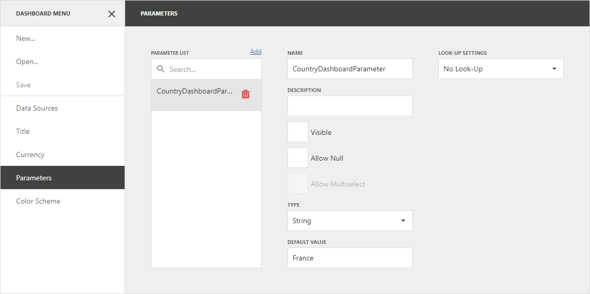
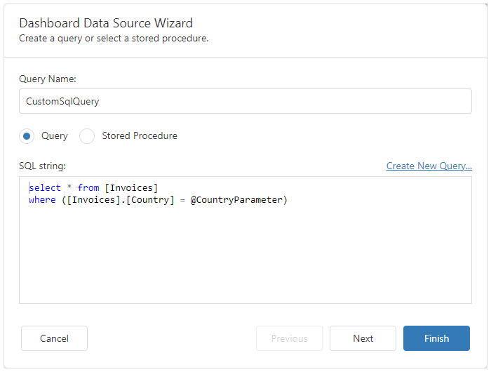
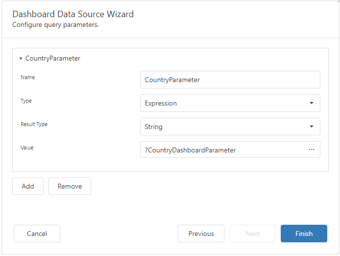

<!-- default badges list -->

<!-- default badges end -->
# Dashboard for ASP.NET Core - How to pass a hidden dashboard parameter to a custom SQL query

This example shows how to pass a hidden [dashboard parameter](https://docs.devexpress.com/Dashboard/117062) to a [custom SQL query](https://docs.devexpress.com/Dashboard/117193).

First, [create a dashboard parameter](https://docs.devexpress.com/Dashboard/117547). To do this, open the [dashboard menu](https://docs.devexpress.com/Dashboard/117444) and go to the **Parameters** section. In this section, add a new parameter and specify its settings. Disable the [**Visible**](https://docs.devexpress.com/Dashboard/js-DevExpress.Dashboard.Model.Parameter#js_devexpress_dashboard_model_parameter_parametervisible) checkbox to make the parameter invisible to users. In this example, the dashboard parameter's name is **CustomerIdDashboardParameter**:

 
To allow custom SQL queries execution on the server, set the [DashboardConfigurator.AllowExecutingCustomSql](https://docs.devexpress.com/Dashboard/117193/web-dashboard/create-dashboards-on-the-web/providing-data/working-with-sql-data-sources/custom-sql-queries) property to `true`. To allow end users to edit a custom SQL string in the SQL String editor, pass `true` to the [DataSourceWizardOptionBuilder.EnableCustomSql](https://docs.devexpress.com/Dashboard/DevExpress.DashboardAspNetCore.DataSourceWizardOptionBuilder.EnableCustomSql(System.Boolean)) method. You can see the query specified for the data source in the [Data Source Wizard](https://docs.devexpress.com/Dashboard/117680):
 

This query contains a query parameter named **CustomerIdParameter**. To be able to change the parameter's value, bind it to the **CustomerIdDashboardParameter** dashboard parameter. To do this, on the second page of the Data Source Wizard set the parameter's type to *Expression* and specify the corresponding dashboard parameter in the **Value** field :

In this example, the [`DashboardConfigurator.CustomParameters`](https://docs.devexpress.com/Dashboard/DevExpress.DashboardWeb.DashboardConfigurator.CustomParameters) is handled to change the dashboard parameter's default value before it is passed to the query. 

As the result, the users see the dashboard based on the data from the SQL query with the **CustomerIdParameter** parameter's value which was specified in the `DashboardConfigurator.CustomParameters` event.

## Files to Review

* [DashboardUtils.cs](./CS/AspNetCoreDashboard_CustomParameters/Code/DashboardUtils.cs)
* [Index.cshtml](./CS/AspNetCoreDashboard_CustomParameters/Pages/Index.cshtml)

## Documentation

- [Dashboard Parameters](https://docs.devexpress.com/Dashboard/117062/web-dashboard/create-dashboards-on-the-web/data-analysis/dashboard-parameters)
- [Query Parameters](https://docs.devexpress.com/Dashboard/117192/web-dashboard/create-dashboards-on-the-web/providing-data/working-with-sql-data-sources/pass-query-parameters)
- [Custom SQL Queries](https://docs.devexpress.com/Dashboard/117193/web-dashboard/create-dashboards-on-the-web/providing-data/working-with-sql-data-sources/custom-sql-queries)

## More Examples

- [Dashboard for Web Forms - How to pass a hidden dashboard parameter to a custom SQL query](https://github.com/DevExpress-Examples/aspxdashboard-how-to-pass-a-hidden-dashboard-parameter-to-a-custom-sql-query-t491903)
- [Dashboard for Web Forms - How to specify dashboard parameter values on the client side](https://github.com/DevExpress-Examples/aspxdashboard-how-to-specify-dashboard-parameter-values-on-the-client-side-t495684)
- [Dashboard for Web Forms - How to update the parameter value when the item's master filter state is changed](https://github.com/DevExpress-Examples/how-to-update-the-parameter-value-when-the-items-master-filter-state-is-changed-t575012)

